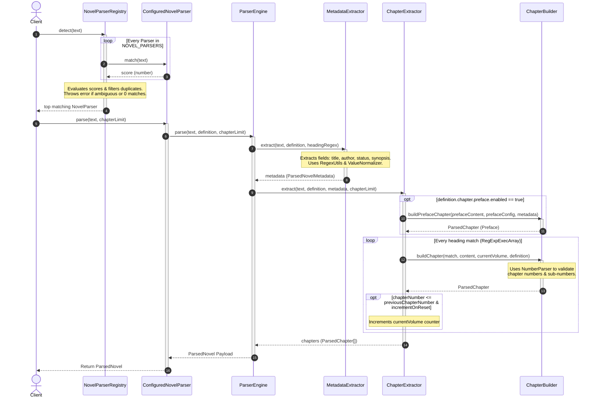

```mermaid
sequenceDiagram
    autonumber
    actor Client
    participant Registry as NovelParserRegistry
    participant Parser as ConfiguredNovelParser
    participant Engine as ParserEngine
    participant MetaExt as MetadataExtractor
    participant ChapExt as ChapterExtractor
    participant Builder as ChapterBuilder

    %% 1. Format Detection
    Client ->> Registry: detect(text)
    activate Registry
    loop Every Parser in NOVEL_PARSERS
        Registry ->> Parser: match(text)
        Parser -->> Registry: score (number)
    end
    Note over Registry: Evaluates scores & filters duplicates.<br/>Throws error if ambiguous or 0 matches.
    Registry -->> Client: top matching NovelParser
    deactivate Registry

    %% 2. Execution Initiation
    Client ->> Parser: parse(text, chapterLimit)
    activate Parser
    Parser ->> Engine: parse(text, definition, chapterLimit)
    activate Engine

    %% 3. Extracting Metadata
    Engine ->> MetaExt: extract(text, definition, headingRegex)
    activate MetaExt
    Note over MetaExt: Extracts fields: title, author, status, synopsis.<br/>Uses RegexUtils & ValueNormalizer.
    MetaExt -->> Engine: metadata (ParsedNovelMetadata)
    deactivate MetaExt

    %% 4. Extracting Chapters
    Engine ->> ChapExt: extract(text, definition, metadata, chapterLimit)
    activate ChapExt
    
    %% 4a. Preface check
    opt definition.chapter.preface.enabled == true
        ChapExt ->> Builder: buildPrefaceChapter(prefaceContent, prefaceConfig, metadata)
        activate Builder
        Builder -->> ChapExt: ParsedChapter (Preface)
        deactivate Builder
    end

    %% 4b. Loop through matches
    loop Every heading match (RegExpExecArray)
        ChapExt ->> Builder: buildChapter(match, content, currentVolume, definition)
        activate Builder
        Note over Builder: Uses NumberParser to validate<br/>chapter numbers & sub-numbers.
        Builder -->> ChapExt: ParsedChapter
        deactivate Builder
        
        opt chapterNumber <= previousChapterNumber & incrementOnReset
            Note over ChapExt: Increments currentVolume counter
        end
    end
    
    ChapExt -->> Engine: chapters (ParsedChapter[])
    deactivate ChapExt

    %% 5. Consolidation and Return
    Engine -->> Parser: ParsedNovel Payload
    deactivate Engine
    Parser -->> Client: Return ParsedNovel
    deactivate Parser
```