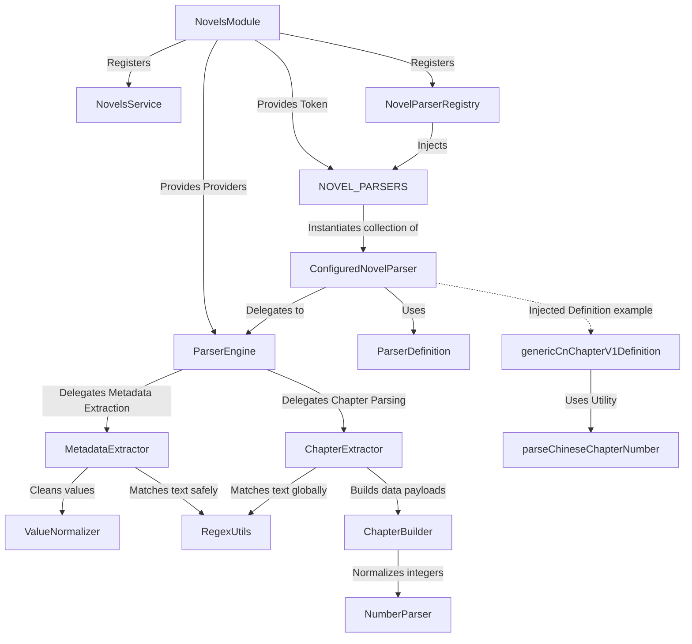

```mermaid
graph TD
    %% Main Module & Entry
    NovelsModule -->|Registers| NovelsService
    NovelsModule -->|Registers| NovelParserRegistry
    NovelsModule -->|Provides Providers| ParserEngine
    NovelsModule -->|Provides Token| NOVEL_PARSERS
    
    %% Registry Structure
    NovelParserRegistry -->|Injects| NOVEL_PARSERS
    NOVEL_PARSERS -->|Instantiates collection of| ConfiguredNovelParser
    
    %% Configured Parser Core
    ConfiguredNovelParser -->|Uses| ParserDefinition
    ConfiguredNovelParser -->|Delegates to| ParserEngine
    
    %% Engine Pipeline
    ParserEngine -->|Delegates Metadata Extraction| MetadataExtractor
    ParserEngine -->|Delegates Chapter Parsing| ChapterExtractor
    
    %% Extractor Helpers
    MetadataExtractor -->|Cleans values| ValueNormalizer
    MetadataExtractor -->|Matches text safely| RegexUtils
    
    ChapterExtractor -->|Builds data payloads| ChapterBuilder
    ChapterExtractor -->|Matches text globally| RegexUtils
    
    ChapterBuilder -->|Normalizes integers| NumberParser
    
    %% Definitions Layer
    ConfiguredNovelParser -.->|Injected Definition example| genericCnChapterV1Definition
    genericCnChapterV1Definition -->|Uses Utility| parseChineseChapterNumber
```